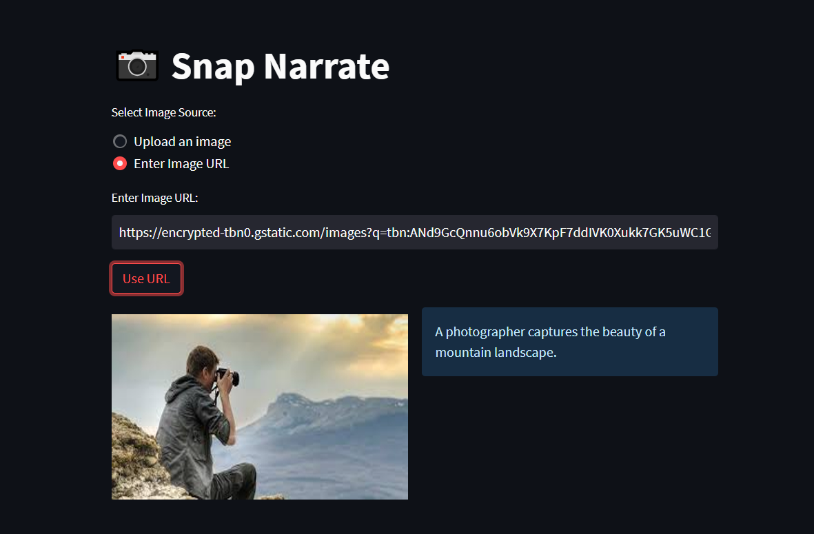

# Image-Captioning-Web-App-with-Gemini-Pro-Vision

### STEPS to run the project:

### STEP 01- Clone the repository

```bash
Project repo: https://github.com/riad5089/Image-Captioning-Web-App-with-Gemini-Pro-Vision.git
```

### STEP 02-Create a conda environment after opening the repository

```bash
python -m venv env
```

```bash
env\Scripts\activate
```
### STEP 03- install the requirements
```bash
pip install -r requirements.txt



